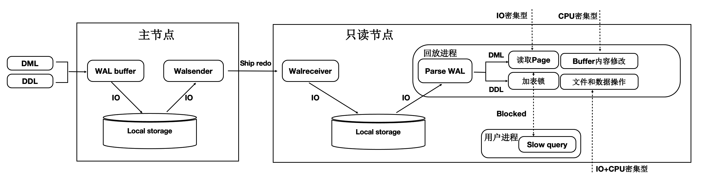
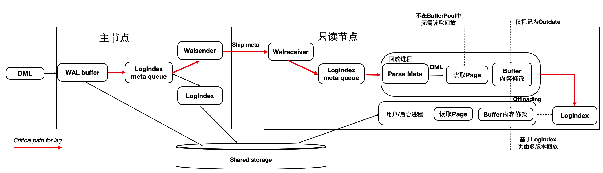
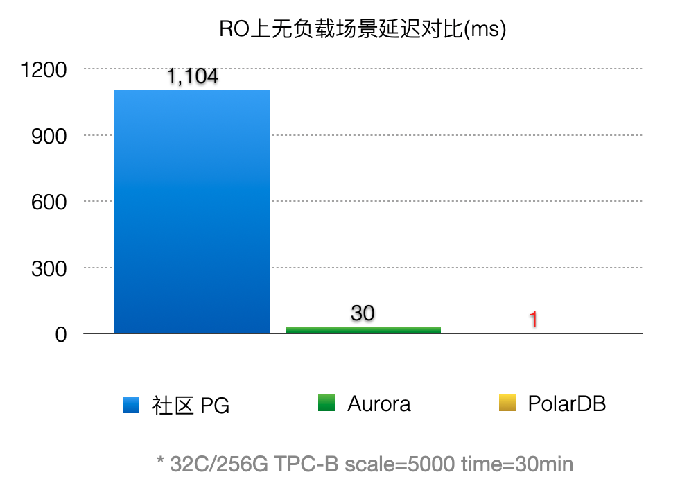
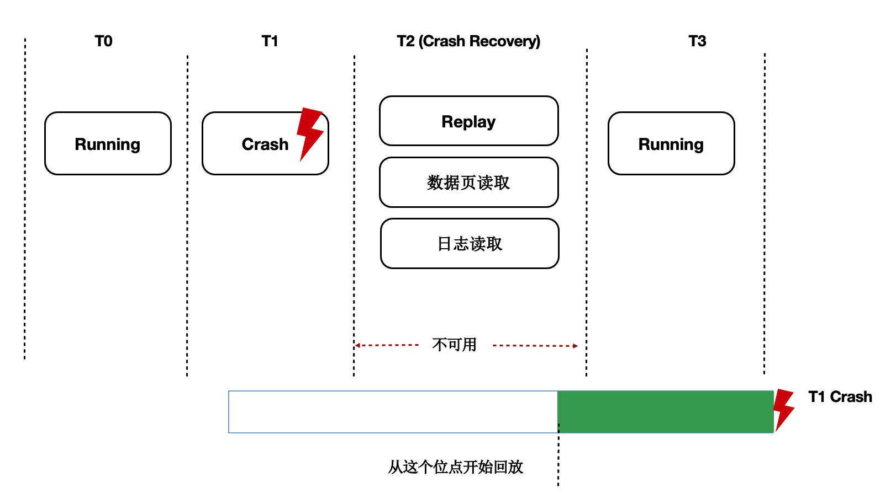
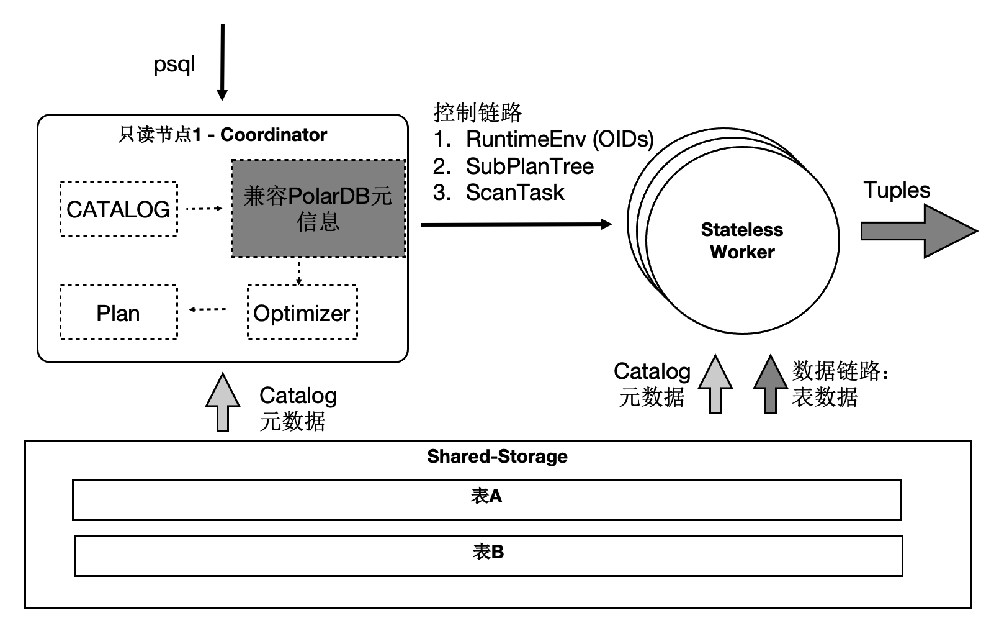
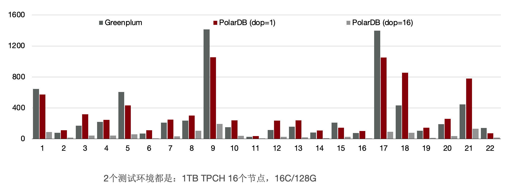
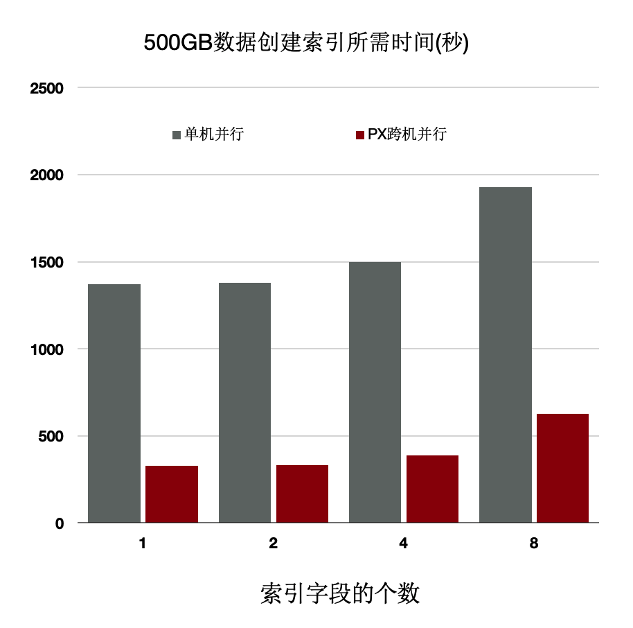

# 特性总览

<ArticleInfo :frontmatter=$frontmatter></ArticleInfo>

PolarDB for PostgreSQL（以下简称 PolarDB）是一款阿里云自主研发的企业级数据库产品，采用计算存储分离架构，100% 兼容 PostgreSQL。PolarDB 的存储与计算能力均可横向扩展，具有高可靠、高可用、弹性扩展等企业级数据库特性。同时，PolarDB 具有大规模并行计算能力，可以应对 OLTP 与 OLAP 混合负载；还具有时空、向量、搜索、图谱等多模创新特性，可以满足企业对数据处理日新月异的新需求。

PolarDB 支持多种部署形态：存储计算分离部署、X-Paxos 三节点部署、本地盘部署。

[[toc]]

## 传统数据库的问题

随着用户业务数据量越来越大，业务越来越复杂，传统数据库系统面临巨大挑战，如：

1. 存储空间无法超过单机上限。
2. 通过只读实例进行读扩展，每个只读实例独享一份存储，成本增加。
3. 随着数据量增加，创建只读实例的耗时增加。
4. 主备延迟高。

## PolarDB 云原生数据库的优势

针对上述传统数据库的问题，阿里云研发了 PolarDB 云原生数据库。采用了自主研发的计算集群和存储集群分离的架构。具备如下优势：

1. 扩展性：存储计算分离，极致弹性。
2. 成本：共享一份数据，存储成本低。
3. 易用性：一写多读，透明读写分离。
4. 可靠性：三副本、秒级备份。

## PolarDB 整体架构概述

下面会从两个方面来解读 PolarDB 的架构，分别是：存储计算分离架构、HTAP 架构。

### 存储计算分离架构概述

PolarDB 是存储计算分离的设计，存储集群和计算集群可以分别独立扩展：

1. 当计算能力不够时，可以单独扩展计算集群。
2. 当存储容量不够时，可以单独扩展存储集群。

基于 Shared-Storage 后，主节点和多个只读节点共享一份存储数据，主节点刷脏不能再像传统的刷脏方式了，否则：

1. 只读节点去存储中读取的页面，可能是比较老的版本，不符合他自己的状态。
2. 只读节点指读取到的页面比自身内存中想要的数据要超前。
3. 主节点切换到只读节点时，只读节点接管数据更新时，存储中的页面可能是旧的，需要读取日志重新对脏页的恢复。

对于第一个问题，我们需要有页面多版本能力；对于第二个问题，我们需要主库控制脏页的刷脏速度。

### HTAP 架构概述

读写分离后，单个计算节点无法发挥出存储侧大 IO 带宽的优势，也无法通过增加计算资源来加速大的查询。我们研发了基于 Shared-Storage 的 MPP 分布式并行执行，来加速在 OLTP 场景下 OLAP 查询。
PolarDB 支持一套 OLTP 场景型的数据在如下两种计算引擎下使用：

- 单机执行引擎：处理高并发的 OLTP 型负载。
- 分布式执行引擎：处理大查询的 OLAP 型负载。

在使用相同的硬件资源时性能达到了传统 MPP 数据库的 90%，同时具备了 SQL 级别的弹性：在计算能力不足时，可随时增加参与 OLAP 分析查询的 CPU，而数据无需重分布。

## PolarDB：存储计算分离架构详解

### Shared-Storage 带来的挑战

基于 Shared-Storage 之后，数据库由传统的 share nothing，转变成了 shared storage 架构。需要解决如下问题：

- 数据一致性：由原来的 N 份计算+N 份存储，转变成了 N 份计算+1 份存储。
- 读写分离：如何基于新架构做到低延迟的复制。
- 高可用：如何 Recovery 和 Failover。
- IO 模型：如何从 Buffer-IO 向 Direct-IO 优化。

### 架构原理

首先来看下基于 Shared-Storage 的 PolarDB 的架构原理。

- 主节点为可读可写节点（RW），只读节点为只读（RO）。
- Shared-Storage 层，只有主节点能写入，因此主节点和只读节点能看到一致的落盘的数据。
- 只读节点的内存状态是通过回放 WAL 保持和主节点同步的。
- 主节点的 WAL 日志写到 Shared-Storage，仅复制 WAL 的 meta 给只读节点。
- 只读节点从 Shared-Storage 上读取 WAL 并回放。

### 数据一致性

#### 传统数据库的内存状态同步

传统 share nothing 的数据库，主节点和只读节点都有自己的内存和存储，只需要从主节点复制 WAL 日志到只读节点，并在只读节点上依次回放日志即可，这也是复制状态机的基本原理。

#### 基于 Shared-Storage 的内存状态同步

前面讲到过存储计算分离后，Shared-Storage 上读取到的页面是一致的，内存状态是通过从 Shared-Storage 上读取最新的 WAL 并回放得来，如下图：

1. 主节点通过刷脏把版本 200 写入到 Shared-Storage。
1. 只读节点基于版本 100，并回放日志得到 200。

#### 基于 Shared-Storage 的“过去页面”

上述流程中，只读节点中基于日志回放出来的页面会被淘汰掉，此后需要再次从存储上读取页面，会出现读取的页面是之前的老页面，称为“过去页面”。如下图：

1. T1 时刻，主节点在 T1 时刻写入日志 LSN=200，把页面 P1 的内容从 500 更新到 600；
1. 只读节点此时页面 P1 的内容是 500；
1. T2 时刻，主节点将日志 200 的 meta 信息发送给只读节点，只读节点得知存在新的日志；
1. T3 时刻，此时在只读节点上读取页面 P1，需要读取页面 P1 和 LSN=200 的日志，进行一次回放，得到 P1 的最新内容为 600；
1. T4 时刻，只读节点上由于 BufferPool 不足，将回放出来的最新页面 P1 淘汰掉；
1. 主节点没有将最新的页面 P1 为 600 的最新内容刷脏到 Shared-Storage 上；
1. T5 时刻，再次从只读节点上发起读取 P1 操作，由于内存中已把 P1 淘汰掉了，因此从 Shared-Storage 上读取，此时读取到了“过去页面”的内容；

#### “过去页面” 的解法

只读节点在任意时刻读取页面时，需要找到对应的 Base 页面和对应起点的日志，依次回放。如下图：

1. 在只读节点内存中维护每个 Page 对应的日志 meta。
2. 在读取时一个 Page 时，按需逐个应用日志直到期望的 Page 版本。
3. 应用日志时，通过日志的 meta 从 Shared-Storage 上读取。

通过上述分析，需要维护每个 Page 到日志的“倒排”索引，而只读节点的内存是有限的，因此这个 Page 到日志的索引需要持久化，PolarDB 设计了一个可持久化的索引结构 - LogIndex。LogIndex 本质是一个可持久化的 hash 数据结构。

1. 只读节点通过 WAL receiver 接收从主节点过来的 WAL meta 信息。
2. WAL meta 记录该条日志修改了哪些 Page。
3. 将该条 WAL meta 插入到 LogIndex 中，key 是 PageID，value 是 LSN。
4. 一条 WAL 日志可能更新了多个 Page（索引分裂），在 LogIndex 对有多条记录。
5. 同时在 BufferPool 中给该 Page 打上 outdate 标记，以便使得下次读取的时候从 LogIndex 重回放对应的日志。
6. 当内存达到一定阈值时，LogIndex 异步将内存中的 hash 刷到盘上。

通过 LogIndex 解决了刷脏依赖“过去页面”的问题，也是得只读节点的回放转变成了 Lazy 的回放：只需要回放日志的 meta 信息即可。

#### 基于 Shared-Storage 的“未来页面”

在存储计算分离后，刷脏依赖还存在“未来页面”的问题。如下图所示：

1. T1 时刻，主节点对 P1 更新了 2 次，产生了 2 条日志，此时主节点和只读节点上页面 P1 的内容都是 500。
2. T2 时刻， 发送日志 LSN=200 给只读节点。
3. T3 时刻，只读节点回放 LSN=200 的日志，得到 P1 的内容为 600，此时只读节点日志回放到了 200，后面的 LSN=300 的日志对他来说还不存在。
4. T4 时刻，主节点刷脏，将 P1 最新的内容 700 刷到了 Shared-Storage 上，同时只读节点上 BufferPool 淘汰掉了页面 P1。
5. T5 时刻，只读节点再次读取页面 P1，由于 BufferPool 中不存在 P1，因此从共享内存上读取了最新的 P1，但是只读节点并没有回放 LSN=300 的日志，读取到了一个对他来说超前的“未来页面”。
6. “未来页面”的问题是：部分页面是未来页面，部分页面是正常的页面，会到时数据不一致，比如索引分裂成 2 个 Page 后，一个读取到了正常的 Page，另一个读取到了“未来页面”，B+Tree 的索引结构会被破坏。

#### “未来页面”的解法

“未来页面”的原因是主节点刷脏的速度超过了任一只读节点的回放速度（虽然只读节点的 Lazy 回放已经很快了）。因此，解法就是对主节点刷脏进度时做控制：不能超过最慢的只读节点的回放位点。如下图所示：

1. 只读节点回放到 T4 位点。
2. 主节点在刷脏时，对所有脏页按照 LSN 排序，仅刷在 T4 之前的脏页(包括 T4)，之后的脏页不刷。
3. 其中，T4 的 LSN 位点称为“一致性位点”。

### 低延迟复制

#### 传统流复制的问题

1. 同步链路：日志同步路径 IO 多，网络传输量大。
1. 页面回放：读取和 Buffer 修改慢（IO 密集型 + CPU 密集型）。
1. DDL 回放：修改文件时需要对修改的文件加锁，而加锁的过程容易被阻塞，导致 DDL 慢。
1. 快照更新：RO 高并发引起事务快照更新慢。

如下图所示：

1. 主节点写入 WAL 日志到单机文件系统中。
1. WAL Sender 进程读取，并发送。
1. 只读节点的 WAL Receiver 进程接收写入到单机文件系统中。
1. 回放进程读取 WAL 日志，读取对应的 Page 到 BufferPool 中，并在内存中回放。
1. 主节点刷脏页到 Shared Storage。

可以看到，整个链路是很长的，只读节点延迟高，影响用户业务读写分离负载均衡。

#### 优化 1：只复制 Meta

因为底层是 Shared-Storage，只读节点可直接从 Shared-Storage 上读取所需要的 WAL 数据。因此主节点只把 WAL 日志的元数据（去掉 Payload）复制到只读节点，这样网络传输量小，减少关键路径上的 IO。如下图所示：

1. WAL Record 是由：Header，PageID，Payload 组成。
1. 由于只读节点可以直接读取 Shared-Storage 上的 WAL 文件，因此主节点只把 WAL 日志的元数据发送（复制）到只读节点，包括：Header，PageID。
1. 在只读节点上，通过 WAL 的元数据直接读取 Shared-Storage 上完整的 WAL 文件。

通过上述优化，能显著减少主节点和只读节点间的网络传输量。从下图可以看到网络传输量减少了 98%。

#### 优化 2：页面回放优化

在传统 DB 中日志回放的过程中会读取大量的 Page 并逐个日志 Apply，然后落盘。该流程在用户读 IO 的关键路径上，借助存储计算分离可以做到：如果只读节点上 Page 不在 BufferPool 中，不产生任何 IO，仅仅记录 LogIndex 即可。

可以将回放进程中的如下 IO 操作 offload 到 session 进程中：

1. 数据页 IO 开销。
1. 日志 apply 开销。
1. 基于 LogIndex 页面的多版本回放。

如下图所示，在只读节点上的回放进程中，在 Apply 一条 WAL 的 meta 时：

1. 如果对应 Page 不在内存中，仅仅记录 LogIndex。
1. 如果对应的 Page 在内存中，则标记为 Outdate，并记录 LogIndex，回放过程完成。
1. 用户 session 进程在读取 Page 时，读取正确的 Page 到 BufferPool 中，并通过 LogIndex 来回放相应的日志。
1. 可以看到，主要的 IO 操作由原来的单个回放进程 offload 到了多个用户进程。

通过上述优化，能显著减少回放的延迟，比 AWS Aurora 快 30 倍。

#### 优化 3：DDL 锁回放优化

在主节点执行 DDL 时，比如：drop table，需要在所有节点上都对表上排他锁，这样能保证表文件不会在只读节点上读取时被主节点删除掉了（因为文件在 Shared-Storage 上只有一份）。在所有只读节点上对表上排他锁是通过 WAL 复制到所有的只读节点，只读节点回放 DDL 锁来完成。而回放进程在回放 DDL 锁时，对表上锁可能会阻塞很久，因此可以通过把 DDL 锁也 offload 到其他进程上来优化回放进程的关键路径。

通过上述优化，能够回放进程一直处于平滑的状态，不会因为去等 DDL 而阻塞了回放的关键路径。

上述 3 个优化之后，极大的降低了复制延迟，能够带来如下优势：

- 读写分离：负载均衡，更接近 Oracle RAC 使用体验。
- 高可用：加速 HA 流程。
- 稳定性：最小化未来页的数量，可以写更少或者无需写页面快照。

### Recovery 优化

#### 背景

数据库 OOM、Crash 等场景恢复时间长，本质上是日志回放慢，在共享存储 Direct-IO 模型下问题更加突出。

#### Lazy Recovery

前面讲到过通过 LogIndex 我们在只读节点上做到了 Lazy 的回放，那么在主节点重启后的 recovery 过程中，本质也是在回放日志，那么我们可以借助 Lazy 回放来加速 recovery 的过程：

1. 从 checkpoint 点开始逐条去读 WAL 日志。
1. 回放完 LogIndex 日志后，即认为回放完成。
1. recovery 完成，开始提供服务。
1. 真正的回放被 offload 到了重启之后进来的 session 进程中。

优化之后（回放 500MB 日志量）：

#### Persistent BufferPool

上述方案优化了在 recovery 的重启速度，但是在重启之后，session 进程通过读取 WAL 日志来回放想要的 page。表现就是在 recovery 之后会有短暂的响应慢的问题。优化的办法为在数据库重启时 BufferPool 并不销毁，如下图所示：crash 和 restart 期间 BufferPool 不销毁。

内核中的共享内存分成 2 部分：

1. 全局结构，ProcArray 等。
1. BufferPool 结构；其中 BufferPool 通过具名共享内存来分配，在进程重启后仍然有效。而全局结构在进程重启后需要重新初始化。

而 BufferPool 中并不是所有的 Page 都是可以复用的，比如：在重启前，某进程对 Page 上 X 锁，随后 crash 了，该 X 锁就没有进程来释放了。因此，在 crash 和 restart 之后需要把所有的 BufferPool 遍历一遍，剔除掉不能被复用的 Page。另外，BufferPool 的回收依赖 k8s。该优化之后，使得重启前后性能平稳。

## PolarDB：HTAP 架构详解

PolarDB 读写分离后，由于底层是存储池，理论上 IO 吞吐是无限大的。而大查询只能在单个计算节点上执行，单个计算节点的 CPU/MEM/IO 是有限的，因此单个计算节点无法发挥出存储侧的大 IO 带宽的优势，也无法通过增加计算资源来加速大的查询。我们研发了基于 Shared-Storage 的 MPP 分布式并行执行，来加速在 OLTP 场景下 OLAP 查询。

### HTAP 架构原理

PolarDB 底层存储在不同节点上是共享的，因此不能直接像传统 MPP 一样去扫描表。我们在原来单机执行引擎上支持了 MPP 分布式并行执行，同时对 Shared-Storage 进行了优化。
基于 Shared-Storage 的 MPP 是业界首创，它的原理是：

1. Shuffle 算子屏蔽数据分布。
1. ParallelScan 算子屏蔽共享存储。

如图所示：

1. 表 A 和表 B 做 join，并做聚合。
1. 共享存储中的表仍然是单个表，并没有做物理上的分区。
1. 重新设计 4 类扫描算子，使之在扫描共享存储上的表时能够分片扫描，形成 virtual partition。

### 分布式优化器

基于社区的 GPORCA 优化器扩展了能感知共享存储特性的 Transformation Rules。使得能够探索共享存储下特有的 Plan 空间，比如：对于一个表在 PolarDB 中既可以全量的扫描，也可以分区域扫描，这个是和传统 MPP 的本质区别。图中，上面灰色部分是 PolarDB 内核与 GPORCA 优化器的适配部分。下半部分是 ORCA 内核，灰色模块是我们在 ORCA 内核中对共享存储特性所做的扩展。

### 算子并行化

PolarDB 中有 4 类算子需要并行化，下面介绍一个具有代表性的 Seqscan 的算子的并行化。为了最大限度的利用存储的大 IO 带宽，在顺序扫描时，按照 4MB 为单位做逻辑切分，将 IO 尽量打散到不同的盘上，达到所有的盘同时提供读服务的效果。这样做还有一个优势，就是每个只读节点只扫描部分表文件，那么最终能缓存的表大小是所有只读节点的 BufferPool 总和。

下面的图表中：

1. 增加只读节点，扫描性能线性提升 30 倍。
1. 打开 Buffer 时，扫描从 37 分钟降到 3.75 秒。

### 消除数据倾斜问题

倾斜是传统 MPP 固有的问题：

1. 在 PolarDB 中，大对象的是通过 heap 表关联 TOAST​ 表，无论对哪个表切分都无法达到均衡。
1. 另外，不同只读节点的事务、buffer、网络、IO 负载抖动。

以上两点会导致分布执行时存在长尾进程。

1. 协调节点内部分成 DataThread 和 ControlThread。
1. DataThread 负责收集汇总元组。
1. ControlThread 负责控制每个扫描算子的扫描进度。
1. 扫描快的工作进程能多扫描逻辑的数据切片。
1. 过程中需要考虑 Buffer 的亲和性。

需要注意的是：尽管是动态分配，尽量维护 buffer 的亲和性；另外，每个算子的上下文存储在 worker 的私有内存中，Coordinator 不存储具体表的信息；

下面表格中，当出现大对象时，静态切分出现数据倾斜，而动态扫描仍然能够线性提升。

### SQL 级别弹性扩展

那我们利用数据共享的特点，还可以支持云原生下极致弹性的要求：把 Coordinator 全链路上各个模块所需要的外部依赖存在共享存储上，同时 worker 全链路上需要的运行时参数通过控制链路从 Coordinator 同步过来，使 Coordinator 和 worker 无状态化。

因此：

1. SQL 连接的任意只读节点都可以成为 Coordinator 节点，这解决了 Coordinator 单点问题。
2. 一个 SQL 能在任意节点上启动任意 worker 数目，达到算力能 SQL 级别弹性扩展，也允许业务有更多的调度策略：不同业务域同时跑在不同的节点集合上。

### 事务一致性

多个计算节点数据一致性通过等待回放和 globalsnapshot 机制来完成。等待回放保证所有 worker 能看到所需要的数据版本，而 globalsnapshot 保证了选出一个统一的版本。

### TPC-H 性能：加速比

我们使用 1TB 的 TPC-H 进行了测试，首先对比了 PolarDB 新的分布式并行和单机并行的性能：有 3 个 SQL 提速 60 倍，19 个 SQL 提速 10 倍以上；

另外，使用分布式执行引擎测，试增加 CPU 时的性能，可以看到，从 16 核和 128 核时性能线性提升；单看 22 条 SQL，通过该增加 CPU，每个条 SQL 性能线性提升。

### TPC-H 性能：和传统 MPP 数据库的对比

与传统 MPP 数据库相比，同样使用 16 个节点，PolarDB 的性能是传统 MPP 数据库的 90%。

前面讲到我们给 PolarDB 的分布式引擎做到了弹性扩展，数据不需要充分重分布，当 dop = 8 时，性能是传统 MPP 数据库的 5.6 倍。

### 分布式执行加速索引创建

OLTP 业务中会建大量的索引，经分析建索引过程中：80%是在排序和构建索引页，20%在写索引页。通过使用分布式并行来加速排序过程，同时流水化批量写入。

上述优化能够使得创建索引有 4~5 倍的提升。

### 分布式并行执行加速多模：时空数据库

PolarDB 是对多模数据库，支持时空数据。时空数据库是计算密集型和 IO 密集型，可以借助分布式执行来加速。我们针对共享存储开发了扫描共享 RTREE 索引的功能。

- 数据量：40000 万，500 GB
- 规格：5 个只读节点，每个节点规格为 16 核 CPU、128 GB 内存
- 性能：
  - 随 CPU 数目线性提升
  - 共 80 核 CPU 时，提升**71 倍**

## 总结

本文从架构层面分析了 PolarDB 的技术要点：

- 存储计算分离架构。
- HTAP 架构。

后续文章将具体讨论更多的技术细节，比如：如何基于 Shared-Storage 的查询优化器，LogIndex 如何做到高性能，如何闪回到任意时间点，如何在 Shared-Storage 上支持 MPP，如何和 X-Paxos 结合构建高可用等等，敬请期待。
