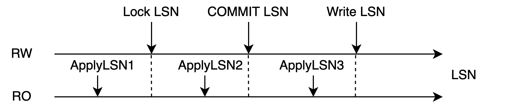

# DDL 同步

## 概述

在共享存储一写多读的架构下，数据文件实际上只有一份。得益于多版本机制，不同节点的读写实际上并不会冲突。但是有一些数据操作不具有多版本机制，其中比较有代表性的就是文件操作。

多版本机制仅限于文件内的元组，但不包括文件本身。对文件进行创建、删除等操作实际上会对全集群立即可见，这会导致 RO 在读取文件时出现文件消失的情况，因此需要做一些同步操作，来防止此类情况。

对文件进行操作通常使用 DDL，因此对于 DDL 操作，PolarDB 提供了一种同步机制，来防止并发的文件操作的出现。除了同步机制外，DDL 的其他逻辑和单机执行逻辑并无区别。

## 术语

- LSN：Log Sequence Number，日志序列号。是 WAL 日志的唯一标识。LSN 在全局是递增的。
- 回放位点：Apply LSN，表示只读节点的回放位点。

## 同步 DDL 机制

### DDL 锁

同步 DDL 机制利用 AccessExclusiveLock（后文简称 DDL 锁）来进行 RW / RO 的 DDL 操作同步。

|  |
| :----------------------------------------: |
|       图 1：DDL 锁和 WAL 日志的关系        |

DDL 锁是数据库中最高级的表锁，对其他所有的锁级别都互斥，会伴随着 WAL 日志同步到 RO 节点上，并且可以获取到该锁在 WAL 日志的写入位点。当 RO 回放超过 Lock LSN 位点时，就可以认为在 RO 中已经获取了这把锁。DDL 锁会伴随着事务的结束而释放。

如图 1 所示，当回放到 ApplyLSN1 时，表示未获取到 DDL 锁；当回放到 ApplyLSN2 时，表示获取到了该锁；当回放到 ApplyLSN3 时，已经释放了 DDL 锁。

|  |
| :----------------------------------------: |
|           图 2：DDL 锁的获取条件           |

当所有 RO 都回放超过了 Lock LSN 这个位点时（如图 2 所示），可以认为 RW 的事务在集群级别获取到了这把锁。获取到这把锁就意味着 RW / RO 中没有其他的会话能够访问这张表，此时 RW 就可以对这张表做各种文件相关的操作。

> 说明：Standby 有独立的文件存储，获取锁时不会出现上述情况。

|  |
| :----------------------------------------: |
|           图 3：同步 DDL 流程图            |

图 3 所示流程说明如下：

1. RO 会话执行查询语句
1. RW 会话执行 DDL，在本地获取 DDL 锁并且写到 WAL 日志中，等待所有 RO 回放到该 WAL 日志
1. RO 的回放进程尝试获取该锁，获取成功后将回放位点返回给 RW
1. RW 获知所有 RO 均获取到该锁
1. RO 开始进行 DDL 操作

### 如何保证数据正确性

DDL 锁是 PostgreSQL 数据库最高级别的锁，当对一个表进行 DROP / ALTER / LOCK / VACUUM (FULL) table 等操作时，需要先获取到 DDL 锁。RW 是通过用户的主动操作来获取锁，获取锁成功时会写入到日志中，RO 则通过回放日志获取锁。

- 主备环境：热备存在只读查询，同时进行回放，回放到该锁时，如果该表正在被读取，回放就会被阻塞直到超时
- PolarDB 环境：RW 获取锁需要等待 RO 全部获取锁成功才算成功，因为需要确保主备都不再访问共享存储的数据才能进行 DDL 操作

当以下操作的对象都是某张表，`<` 表示时间先后顺序时，同步 DDL 的执行逻辑如下：

1. 本地所有查询操作结束 < 本地获取 DDL 锁 < 本地释放 DDL 锁 < 本地新增查询操作
1. RW 本地获取 DDL 锁 < 各个 RO 获取本地 DDL 锁 < RW 获取全局 DDL 锁
1. RW 获取全局 DDL 锁 < RW 进行写数据操作 < RW 释放全局 DDL 锁

结合以上执行逻辑可以得到以下操作的先后顺序：**各个 RW / RO 查询操作结束 < RW 获取全局 DDL 锁 < RW 写数据 < RW 释放全局 DDL 锁 < RW / RO 新增查询操作**。

可以看到在写共享存储的数据时，RW / RO 上都不会存在查询，因此不会造成正确性问题。在整个操作的过程中，都是遵循 2PL 协议的，因此对于多个表，也可以保证正确性。

## RO 锁回放优化

上述机制中存在一个问题，就是锁同步发生在主备同步的主路径中，当 RO 的锁同步被阻塞时，会造成 RO 的数据同步阻塞（如图 1 所示，回放进程的 3、4 阶段在等待本地查询会话结束后才能获取锁）。PolarDB 默认设置的同步超时时间为 30s，如果 RW 压力过大，有可能造成较大的数据延迟。

RO 中回放的 DDL 锁还会出现叠加效果，例如 RW 在 1s 内写下了 10 个 DDL 锁日志，在 RO 却需要 300s 才能回放完毕。数据延迟对于 PolarDB 是十分危险的，它会造成 RW 无法及时刷脏、及时做检查点，如果此时发生崩溃，恢复系统会需要更长的时间，这会导致极大的稳定性风险。

### 异步 DDL 锁回放

针对此问题，PolarDB 对 RO 锁回放进行了优化。

|  |
| :----------------------------------------: |
|          图 4：RO 异步 DDL 锁回放          |

优化思路：设计一个异步进程来回放这些锁，从而不阻塞主回放进程的工作。

整体流程如图 4 所示，和图 3 不同的是，回放进程会将锁获取的操作卸载到锁回放进程中进行，并且立刻回到主回放流程中，从而不受锁回放阻塞的影响。

锁回放冲突并不是一个常见的情况，因此主回放进程并非将所有的锁都卸载到锁回放进程中进行，它会尝试获取锁，如果获取成功了，就不需要卸载到锁回放进程中进行，这样可以有效减少进程间的同步开销。

该功能在 PolarDB 中默认启用，能够有效的减少回放冲突造成的回放延迟，以及衍生出来的稳定性问题。在 AWS Aurora 中不具备该特性，当发生冲突时会严重增加延迟。

### 如何保证数据正确性

在异步回放的模式下，仅仅是获取锁的操作者变了，但是执行逻辑并未发生变化，依旧能够保证 RW 获取到全局 DDL 锁、写数据、释放全局 DDL 锁这期间不会存在任何查询，因此不会存在正确性问题。
